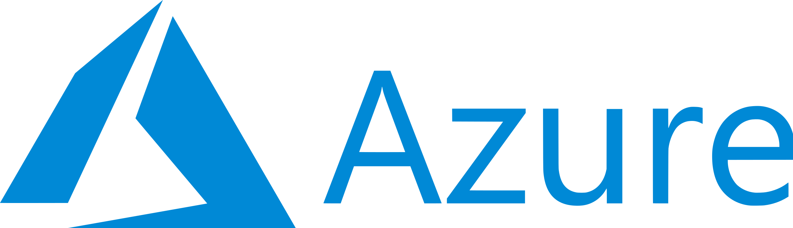

<br/>

<a>
   <p align="center">
      
      
   </p>
</a>
<br/>

# micro-ROS app for Microsoft Azure RTOS

[](https://github.com/micro-ROS/micro_ros_azure_rtos_app/actions/workflows/ci.yml)

This example application has been tested in Azure RTOS 6.1.7 and STMicroelectronics B-L475E-IOT01A.

## Dependencies

This component needs `colcon` and other Python 3 packages in order to build micro-ROS packages:

```bash
pip3 install catkin_pkg lark-parser empy colcon-common-extensions
```

## Usage

1. Clone recursively this repo:

```bash
git clone --recursive https://github.com/micro-ROS/micro_ros_azure_rtos_app
```

2. Configure the CMake project

```bash
cmake -Bbuild -GNinja
```

3. Build the CMake project

```bash
cmake --build build
```

4. Flash the board

```bash
openocd -f interface/stlink-v2-1.cfg -f target/stm32l4x.cfg -c init -c "reset halt" -c "flash write_image erase build/app/stm32l475_azure_iot.bin  0x08000000" -c "reset" -c "exit"
```

## Purpose of the Project

This software is not ready for production use. It has neither been developed nor
tested for a specific use case. However, the license conditions of the
applicable Open Source licenses allow you to adapt the software to your needs.
Before using it in a safety relevant setting, make sure that the software
fulfills your requirements and adjust it according to any applicable safety
standards, e.g., ISO 26262.

## License

This repository is open-sourced under the Apache-2.0 license. See the [LICENSE](LICENSE) file for details.

For a list of other open-source components included in ROS 2 system_modes,
see the file [3rd-party-licenses.txt](3rd-party-licenses.txt).

## Known Issues/Limitations

There are no known limitations.
